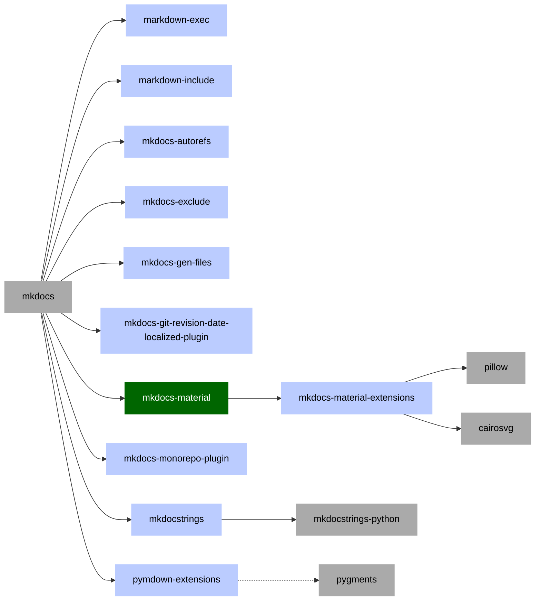

<!-- cspell:ignore dirtyreload squidfunk jazzband pawamoy -->

# From Sphinx to Mkdocs

!!! note

    This document is a work in progress, so expect to be updated as my journey continues.

I been seeing the Sphinx documentation ecosystem aging for years, with fewer
people wanting to contribute to the system each year. I cannot blame them as the
Sphinx is as old as the real Sphinx and it covered a huge number of use cases,
some of them no longer being so relevant.

One first move was to start using MyST parser and convert most of the
documentation from ReST to markdown.

Most potential contributors are likely to know Markdown instead of ReST.
Markdown also renders nicely even on GitHub, without even needing you to compile
the docs.

## Challenges

The [mkdocs] ecosystem is new and far more active than sphinx, but it does not
come without its own set of challenges.

### One dependency too many

Soon after starting to use mkdocs, I found that the list of python packages
needed to build documentation did grow considerably, reaching almost the same
level as with Sphinx.

Lets take a look at those that I identified in the last few weeks, while
converting several python based projects to mkdocs, using the most popular theme
[mkdocs-material][].

### There will be bugs to fix

To put is this way, I already raised pull request to fix bugs in

- fixes proposed to mkdocstrings and mkdocstrings-python the first day
- bug reported to Spotify mkdocs-monorepo-plugin but the projects seem to have a
  silent community
- Bug reported again include and snippets plugins as not working with monorepos,
  got a "not my problem" reply.

### Beware of premium material theme features

While the material theme is probably the best theme I found for open-source
projects, one should also be fully aware that some of the features are limited
to insiders version, a premium offering that allows the project to stay alive
and thrive. One notable mention is that "blog" feature seems to be for insiders
only, for now. The others seem reasonable to me, they were cool features but not
really what I would call essentials.

### Plugins are not always maintained

- The most popular plugin related to combining documentation from multiple
  sub-projects into a single site, [mkdocs-monorepo-plugin] is hosted under
  Spotify @backstage organization. Still, despite having over 200 stars,
  checking its issue tracker and activity makes me believe that it might not
  have a community around it.

## Performance

While mkdocs was very fast on my initial tests, I did start to spot it as
becoming slowing and slower. Luckily it seems that there is `--dirtyreload`
which can be used to speed up the process.

### Possible deeper issues

While I tried multiple approaches for building a single side out of multiple
repositories using mkdocs, I still failed to find a solution that would work and
I think that I spotted something that might be the Achilles heel of mkdocs.

mkdocs documents use only relative paths and that makes sense to me. Still, it
seems that paths are never relative to the current markdown file, but instead
they are relative to either the `mkdocs.yml` or the `docs_dir`, a folder hosting
your documentation, which cannot be the root of the project.

And here is where the multi-site problem starts. Even if you bring all the
repositories under a file tree, you will still have parts of documentation in
multiple different folders. You will no longer have a single `docs_dir`.

As sooner or later you will want to include some examples in your documentation
that are taken from standalone files, you will discover new problems:

- Your include no longer works when building the parent site because all
  inclusion plugins to look for paths relative to `mkdocs.yml` file. And your
  parent `mkdocs.yml` file will always be at a different level than the child
  one.
- mkdocs seems to be quite opinionated on not allowing your to reference files
  from outside your `docs_dir`.

I need to mention that I only tried [markdown-include] and [snippets] plugins so
far for inclusion. Both broke on a multi-site setup.

I am fully aware that I could be [holding it wrongly][1] and that is only my
lack of knowledge for failing to build a multi-site documentation. I guess that
I need to dig more to find the first success example of such compilation.

## Community interaction

- @squidfunk the author of [mkdocs-material] is amazing and does a very good job
  in helping people with
  [answers](https://github.com/squidfunk/mkdocs-material/discussions)
- @pawamoy the author of [mkdocstrings] is also amazing and open to suggestions.
  It was a pleasure to interact with him and get several fixes into
  [mkdocstrings] and [mkdocstrings-python].
- Most of the other plugins are less actively maintained, so you will see
  tickets not being addressed for many months, if not years on some of them. If
  you are lucky you might get some help but I would not bet on it. I am worried
  about the fact that there is no single GitHub organization hosting [mkdocs]
  projects, so most plugins are under personal GitHub accounts. This does not
  ensure the long-term longevity of these projects. Original authors might have
  their priorities changed and you end-up with an ecosystem of abandoned
  projects and forks. I have seen this happening many times with other similar
  ecosystems, enough to suggest mkdocs team to do something about this.

It is perfectly sane to assume that your role with a project is not permanent
and if you care for your creation to survive the test of time, you better plan
from start for it. Hosting your project under an organization that cares about
it, is the first step. I know several success stories such @pytest-dev @jazzband
and @tox-dev from which we can learn.

## If you need includes you are in trouble

With Sphinx and MyST I used includes in multiple places, usually to include some
readme files from the repository root or to include some standalone examples
files into markdown code snippets.

While there are at least two solutions for including content with [mkdocs], they
both are problematic because some decisions that were made regarding how
relative paths are computer, something that breaks badly when you try to build a
single site out of multiple repositories. I am even wondering if this issue is
fixable as it might touch the core concepts on which [mkdocs] is build.

It seems that mkdocs does not provide plugin authors with a way to get the path
of the current document and instead it provides two paths, the
`docs_path: docs/` and the path configuration path. Not only this but it states
clearly that inclusion of files from outside the documentation directory is not
encouraged (or supported?).

Guess what, when building a single site, your master mkdocs.yml file would
clearly be at an upper level than the child ones, so all the paths used by
plugins relative to the configuration file will get broken. Also, the same issue
will happen to `docs_path` which now... you have more than one, as your
documentation files spreads across multiple places.

This journey is still in progress, so over the following weeks, I will have to
update the current document, likely to even rewrite it. Hopefully, it would
prove to be a good experience. For now is clearly interesting and challenging.

[mkdocs]: https://www.mkdocs.org/
[mkdocstrings]: https://mkdocstrings.github.io/
[mkdocstrings-python]: https://mkdocstrings.github.io/python/usage/
[mkdocs-material]: https://squidfunk.github.io/mkdocs-material/
[mkdocs-monorepo-plugin]: https://github.com/backstage/mkdocs-monorepo-plugin
[markdown-include]: https://github.com/cmacmackin/markdown-include
[snippets]:
  https://facelessuser.github.io/pymdown-extensions/extensions/snippets/
[1]:
  https://www.urbandictionary.com/define.php?term=You%27re%20Holding%20It%20Wrong
